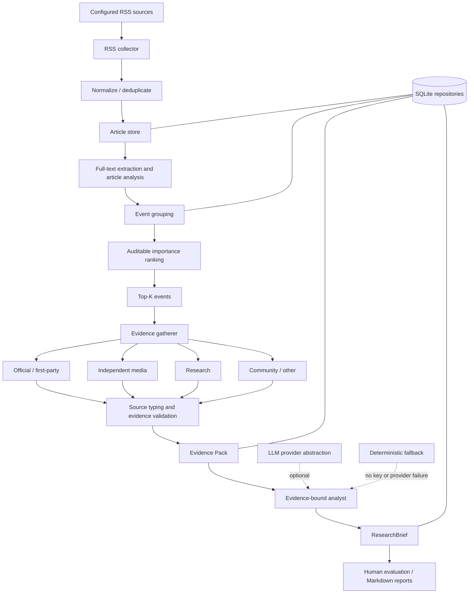

# AI Industry Intelligence Research Agent

[English](README.md) | [简体中文](README.zh-CN.md)

Evidence-grounded AI research workflow for turning large-volume AI news into ranked events, multi-source evidence packs, and structured ResearchBriefs.

**This is not a generic AI news summarizer.** The system separates articles from events, industry importance from source coverage, reported facts from inference, and first-party claims from independent validation.

```text
300+ Articles
    ↓
Normalize & Deduplicate
    ↓
Event Detection → Importance Ranking → Top-K Events
    ↓
Evidence Gathering → Source Typing & Validation
    ↓
Evidence-grounded LLM Research
    ↓
ResearchBrief → Human Evaluation
```

The current portfolio boundary covers Phases 1–2.7. Phase 3 has not started.

## Project overview

AI industry news arrives as a high-volume stream of announcements, reporting, papers, and community discussion. Reading each URL independently creates repeated summaries but does not answer the research questions that matter: what actually happened, how important is it, what evidence supports it, and what remains uncertain?

This local Python pipeline collects configurable RSS sources, normalizes and deduplicates articles, groups them into events, ranks industry importance, gathers typed evidence, and produces evidence-bound ResearchBriefs. SQLite keeps the workflow reproducible; provider interfaces and deterministic fallbacks keep collection and analysis usable without an API key.

Five distinctions drive the design:

| Common shortcut | Research rule used here |
|---|---|
| Article = event | Several articles can describe one event. |
| Multiple URLs = corroboration | Independence depends on source ownership and role, not URL count. |
| Fact = inference | Every key fact is labeled `reported_fact` or `inference`. |
| Vendor claim = validation | First-party benchmarks remain vendor-reported unless independently tested. |
| Source count = verification quality | Source type and evidence semantics determine verification quality. |

## Why this project

A conventional summarizer follows `article → summary`. This project follows `article → event → evidence → research`.

That change enables three things:

- repeated coverage is consolidated around the underlying event;
- ranking asks whether an event matters to the AI industry, separately from whether its claims are well verified;
- the analyst can only cite sources and evidence present in a validated Evidence Pack.

The result is a compact research artifact designed for traceability, comparison, and human review—not a feed of disconnected summaries.

## Core workflow

1. **Collect:** fetch RSS/Atom entries from configuration-driven sources; one failed feed does not stop the others.
2. **Normalize and deduplicate:** canonicalize URLs and compare normalized titles before SQLite persistence.
3. **Extract and process:** fetch full text when possible, then classify, score, and summarize through replaceable interfaces.
4. **Detect events:** conservatively group compatible articles within a time window.
5. **Rank importance:** audit novelty, industry magnitude, ecosystem, developer, creator, source, and recency signals.
6. **Gather evidence:** search for supporting material, normalize URLs, type sources, and build an Evidence Pack.
7. **Research:** run deterministic, single-source LLM, or multi-source LLM analysis against only that pack.
8. **Validate and report:** reject unknown sources or invalid structured output, persist the ResearchBrief, and support human evaluation.

## Architecture



The CLI remains a thin entry point. Services orchestrate collectors, analysis interfaces, and repositories; persistence stays behind the SQLite storage layer.

## Research methodology

### Source typing

Each Evidence Pack item has one research role:

| Source type | Meaning |
|---|---|
| `official` | First-party announcement, documentation, model card, or organization-authored material. |
| `independent_media` | Editorial reporting independent of the subject organization. |
| `research` | Paper or technical report; this does not by itself mean independent replication. |
| `community` | Forum, social post, or community discussion. |
| `other` | Material that does not fit the four roles above. |

**Multiple URLs do not automatically mean independent corroboration.** For example:

```text
NVIDIA Blog
+ NVIDIA Hugging Face model card
+ NVIDIA documentation
= 3 evidence sources

official = 3
independent = 0
```

Those pages increase first-party evidence depth, but they must not be described as independent validation.

### Evidence and claim semantics

- Sources and evidence must map to real IDs and URLs supplied in the Evidence Pack. Unknown references cause validation failure and deterministic fallback.
- `verbatim_quote` must occur in the supplied snippet or content. A model-written approximation is downgraded to `paraphrase` and is not rendered as a quotation.
- Key facts distinguish `reported_fact` from `inference`.
- `claim_confidence` estimates how well the pack supports the brief's core claims.
- `verification_level` describes the kind of support: `single_first_party`, `multi_first_party`, `research_supported`, `independently_corrob`, or `independently_replicated`.
- `independently_replicated` is reserved for explicit independent technical or benchmark reproduction.

Importance and verification remain separate. An industry-wide model release can be important with weak independent coverage; a well-documented customer case can be verified without being industry-defining.

## ResearchBrief schema

ResearchBriefs are persisted as structured records rather than free-form prose. The core fields are:

```text
headline
executive_summary
what_happened
key_facts[]              # reported_fact | inference + source references
background
why_it_matters
industry_impact
ugc_relevance            # level, directness, reason, affected_areas
evidence[]               # verbatim_quote | paraphrase + real URL
sources[]
uncertainties[]
claim_confidence         # 0–1
verification_level
tags
provider_name
```

## Example case studies

Two compact case studies are derived from existing Phase 2.6 live outputs; no new model calls were made for portfolio packaging.

- [Knowledge Distillation](docs/case-studies/knowledge-distillation.md) — combines a practitioner/official post with the accompanying research paper, then separates author-reported systems results from independent replication.
- [Gemini Flash family release](docs/case-studies/gemini-flash.md) — combines Google's announcement with independent media context without treating that coverage as independent validation of Google's benchmarks.

Curated ResearchBrief examples:

- [Knowledge Distillation ResearchBrief](docs/examples/researchbrief_knowledge_distillation.md)
- [Gemini Flash ResearchBrief](docs/examples/researchbrief_gemini_flash.md)

These are selected examples, not the full benchmark or raw runtime reports.

## Human evaluation

The Phase 2.7 pilot compared three modes across the same five real AI industry events and 15 ResearchBriefs. One human reviewer scored factuality, source coverage, relevance, insightfulness, and clarity from 1 to 5.

| Mode | Human score |
|---|---:|
| Deterministic | 2.32 / 5 |
| Single-source LLM | 4.04 / 5 |
| Multi-source LLM | 4.36 / 5 |


In this small pilot, LLM-based research produced stronger human-reviewed results than the deterministic baseline, while multi-source evidence provided additional gains when the added sources contributed meaningful new evidence.

**Evaluation limit:** human-reviewed pilot over 5 events and 15 ResearchBriefs. These results are directional and are not a statistically powered benchmark.

The live validation used `gpt-5.6-terra`. Ten valid live ResearchBriefs were included; one fallback and one invalid smoke output were excluded from the valid-live totals.

## Engineering highlights

1. **RSS historical-feed performance.** A large initial OpenAI RSS response exposed near-quadratic behavior when deduplication repeatedly queried stored URLs and titles. The fix loads repository snapshots into in-memory caches, updates those caches after inserts, retains the SQLite unique URL constraint as a final safeguard, and caps each feed with configurable `max_items`.
2. **Graceful LLM fallback.** Collection, storage, deduplication, deterministic processing, event ranking, and reporting remain available without an API key. Provider or validation failures are logged and fall back without overwriting valid live results.
3. **Source verification.** The LLM cannot invent citations: source IDs, evidence IDs, and URLs must map to the supplied Evidence Pack, and key facts must reference validated evidence.
4. **Live LLM smoke gate.** A single-event smoke run checks provider compatibility, structured JSON, and evidence validation before batch research. The first live request returned HTTP 400; removing the incompatible `temperature` parameter and requesting a JSON object resolved it.
5. **Evidence semantics.** `verbatim_quote` and `paraphrase` are distinct, preventing model-written text from appearing as a literal source quotation.
6. **Auditable ranking.** Eight named dimensions expose why an event ranks highly. Category and scope calibration prevent recency, a generic category bonus, or article base score from dominating importance.

## Cost-aware architecture

High-volume preprocessing is deterministic and local; stronger LLM research is reserved for Top-K events.

```text
300 articles → local processing → events → ranking → Top-K → LLM deep research
```

The Phase 2.6 live experiment produced 10 valid live ResearchBriefs with 36,404 input tokens and 16,152 output tokens: 52,556 tokens in total. At the documented estimation rates, the estimated cost was approximately **$0.27**. This is an experiment-specific estimate, not a general pricing claim. The design goal is a cost-aware workflow, not simply the lowest possible model cost.

## Failure cases and lessons learned

### 1. Article is not an event

The early path resembled `article → summary`. Moving to `article → event → evidence → research` reduced repeated analysis and made corroboration possible.

### 2. Multiple sources are not necessarily independent evidence

The NVIDIA Magpie pack contained three official NVIDIA-controlled sources but no independent source. It improved evidence depth, not independent verification.

### 3. Ranking can reward the wrong signals

An early Virgin Atlantic customer case reached rank #1 because recency, a generic category bonus, and article-level score carried too much weight. The calibrated scorer prioritizes novelty, industry magnitude, ecosystem impact, developer impact, and creator impact. Source coverage now primarily informs verification rather than determining industry importance.

### 4. LLM integration needs a gate

The first live request failed with HTTP 400 because of an incompatible parameter. Structured JSON output, evidence validation, and a smoke test were established before the five-event batch.

## Project structure

```text
app/
  collectors/        RSS/Atom collection interfaces and implementation
  content/           full-text extraction
  analysis/          article analysis interfaces, LLM provider, fallback
  events/            grouping, ranking, ranking audit
  evidence/          gathering, queries, source typing
  research/          evidence-bound analyst, workflow, ResearchBrief reports
  evaluation/        templates, comparison, human evaluation reports
  storage/           SQLite initialization, migration, repositories
  services/          collection, processing, deduplication, reporting
config/               source and pipeline configuration
prompts/              versioned research prompts
evaluation/           committed evaluation records and experiment ledger
tests/                local unit and integration tests
docs/
  case-studies/       compact research-method examples
  examples/           curated ResearchBrief outputs
  assets/             portfolio figures
```

## Quick start

Requires Python 3.11+.

```bash
python -m venv .venv
python -m pip install -e ".[dev]"
```

Activate the environment using the command for your shell, then run the deterministic path—no API key is required:

```bash
python -m app collect
python -m app process
python -m app fetch-content --limit 20
python -m app events --top 10
python -m app research --mode deterministic --top 10
python -m app research-report --mode deterministic --top 10
```

Generated databases, logs, evaluation templates, and reports are local runtime artifacts and are ignored by Git.

### Optional live LLM path

Copy `.env.example` to `.env` and set local credentials:

```dotenv
AI_INTEL_LLM_PROVIDER=openai_compatible
AI_INTEL_LLM_API_KEY=...
AI_INTEL_LLM_MODEL=your-model
AI_INTEL_LLM_BASE_URL=https://api.openai.com/v1
```

Then choose one of the explicit research modes:

```bash
python -m app gather-evidence --top 5
python -m app research --mode single-source-llm --top 5 --force
python -m app research --mode multi-source-llm --top 5 --force
python -m app comparison-report --top 5
```

Never commit `.env` or real credentials.

## CLI examples

```bash
python -m app run --limit 50
python -m app fetch-content --limit 20 --retry-failed
python -m app events --limit 500 --top 10
python -m app reclassify --limit 1000
python -m app ranking-audit --top 10
python -m app evaluation-template --top 5
python -m app evaluate --input evaluation/evaluation_template.json
```

Global configuration options come before the subcommand:

```bash
python -m app --config config/sources.yaml --log-level INFO events --top 10
```

## Limitations

- The evaluation covers 5 events and one human reviewer; it is not statistically powered.
- Event grouping is conservative and lexical rather than semantic, so it favors missed merges over false merges.
- Evidence gathering uses deterministic queries and can still return sparse or first-party-heavy coverage.
- Independent media can corroborate release context without validating vendor benchmarks or production claims.
- Some sites reject generic HTTP clients, reducing full-text coverage and forcing RSS-text fallback.
- SQLite is intentionally designed for a local single-user workflow, not concurrent workers.
- There is no dashboard, review UI, scheduler, or automatic delivery channel.

## Future work

Directions only; none are implemented in the current phase:

- semantic event clustering
- larger evaluation set
- longer-horizon trend detection
- source health monitoring
- cross-model evaluation
- scheduled intelligence delivery

## Testing

```bash
python -m pytest
python -m compileall -q app tests
```

The suite covers normalization, URL/title deduplication, repository caching, source failure isolation, SQLite migrations, content extraction, grouping, ranking, fallback behavior, ResearchBrief validation, evidence semantics, live-output gates, and human-evaluation persistence.
