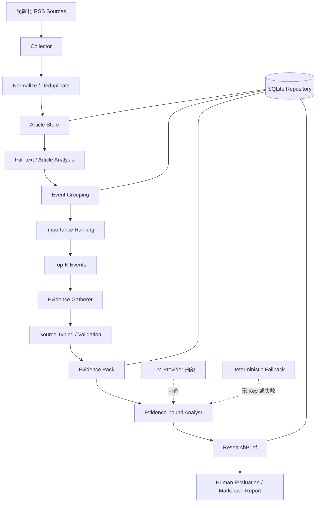
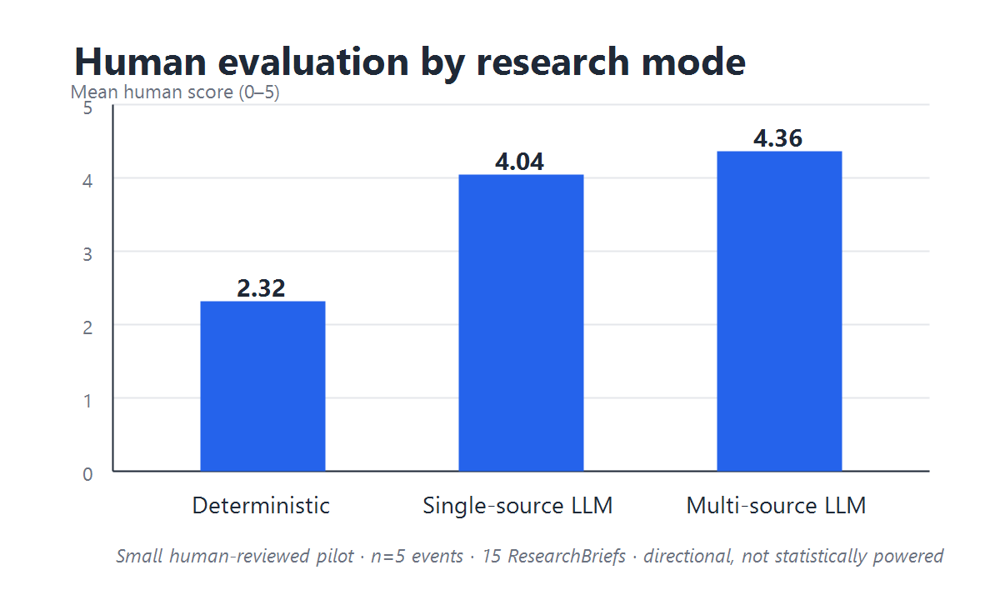

# AI Industry Intelligence Research Agent

[English](README.md) | [简体中文](README.zh-CN.md)

一个将大规模 AI 资讯转化为“事件—证据—研究结论”的 evidence-grounded 行业情报工作流。

**这不是一个普通的 AI 新闻摘要器。** 项目不把每个 URL 当成独立事件，也不把多个链接自动当作独立佐证；它会区分文章与事件、事实与推断、厂商声明与独立验证、行业重要性与证据充分度。

```text
300+ 篇文章
    ↓
标准化与去重
    ↓
事件识别 → 重要性排序 → Top-K
    ↓
证据检索 → 来源分类与校验
    ↓
证据约束的 LLM Research
    ↓
ResearchBrief → 人工评测
```

当前作品集边界为 Phase 1–2.7，尚未进入 Phase 3。

## 项目目标

AI 行业信息分散在公司公告、媒体报道、论文和社区讨论中。逐篇摘要会产生大量重复内容，却很难回答：

- 这些文章是否在描述同一个事件？
- 事件对 AI 行业是否重要？
- 结论由哪些真实证据支持？
- 哪些内容只是推断或厂商自述？
- 还有哪些不确定性？

本项目使用本地 Python 流水线完成 RSS 采集、标准化、URL/标题去重、全文提取、事件聚类、重要性排序、Evidence Gathering、结构化 ResearchBrief 和人工评测。SQLite 保存可追踪状态；LLM 通过接口与工厂接入，没有 API key 时仍可运行 deterministic fallback。

## 核心架构



依赖方向保持简单：

```text
CLI → Pipeline / Services → Collectors + Analysis Interfaces → Repository → SQLite
```

## Research methodology

### 文章不等于事件

早期路径接近 `Article → Summary`。当前路径是：

```text
Article → Event → Evidence → Research
```

多篇文章可以指向同一事件，先做事件抽象才能减少重复、比较来源并进行 Top-K 深度研究。

### 来源分类

Evidence Pack 中每个来源都有明确角色：

| Source type | 含义 |
|---|---|
| `official` | 公司公告、官方文档、模型卡等第一方材料 |
| `independent_media` | 独立于事件主体的编辑报道 |
| `research` | 论文或技术报告；不自动代表独立复现 |
| `community` | 论坛、社交媒体、社区讨论 |
| `other` | 不属于以上类型的材料 |

核心原则：**多个 URL 不自动等于独立佐证。**

例如 NVIDIA Blog、NVIDIA 的 Hugging Face Model Card 和 NVIDIA Documentation 是 3 条证据，但依然是 `official=3, independent=0`。它们增加第一方证据深度，不能被描述为独立验证。

### 幻觉控制

- LLM 返回的 source ID、evidence ID 和 URL 必须映射到真实 Evidence Pack，否则结果被拒绝并回退。
- `verbatim_quote` 必须能在输入正文或 snippet 中找到；模型改写内容会降级为 `paraphrase`。
- `key_facts` 明确区分 `reported_fact` 和 `inference`。
- `claim_confidence` 表示证据对核心 claim 的支持程度。
- `verification_level` 表示证据类型：单一第一方、多第一方、研究支持、独立佐证或独立复现。
- 行业重要性与验证质量分开计算，来源多不等于事件更重要。

## Case Studies

### Knowledge Distillation

[完整案例](docs/case-studies/knowledge-distillation.md)结合 Multiverse Computing 的实践文章与配套论文，展示 Agent 如何识别：

- offline Top-K teacher logits；
- fused chunked KL；
- toy output-projection benchmark 与端到端训练的区别；
- author-reported result 与 independent replication 的区别。

加入论文后，`verification_level` 从 `single_first_party` 提升为 `research_supported`，但依然不能称为独立复现。

### Gemini Flash family release

[完整案例](docs/case-studies/gemini-flash.md)结合 Google 官方公告与 Ars Technica 报道。独立媒体补充了发布背景和产品状态，但没有独立验证 Google 的 benchmark、价格或吞吐量声明。

这个案例展示了如何保留 vendor-reported fact，同时区分 fact、inference 与 uncertainty。

精选 ResearchBrief：

- [Knowledge Distillation](docs/examples/researchbrief_knowledge_distillation.md)
- [Gemini Flash](docs/examples/researchbrief_gemini_flash.md)

## Human Evaluation

对相同的 5 个真实 AI 行业事件生成 15 份 ResearchBrief，由一名人工评审从 factuality、source coverage、relevance、insightfulness、clarity 五个维度评分。

| 模式 | 人工评分 |
|---|---:|
| Deterministic | 2.32 / 5 |
| Single-source LLM | 4.04 / 5 |
| Multi-source LLM | 4.36 / 5 |



这是一项覆盖 5 个事件、15 份 ResearchBrief 的 human-reviewed pilot。结果只用于方向性比较，不是具有统计效力的 benchmark。

Phase 2.6 使用 `gpt-5.6-terra` 完成 live validation，共纳入 10 份有效 live ResearchBrief；fallback 与无效 smoke output 未计入有效结果。

## 工程亮点

1. **RSS 历史数据性能。** OpenAI RSS 首次返回大量历史记录时，逐条数据库查询导致接近 O(n²) 的去重开销。项目改为 repository snapshot + in-memory URL/title cache，并保留 SQLite unique constraint 作为最终防线；每个 source 还能配置 `max_items`。
2. **Graceful LLM fallback。** 无 API key 时，采集、存储、去重、deterministic processing、事件排序与报告仍可运行；LLM 或校验失败不会破坏已保存数据。
3. **Evidence validation。** LLM 不能构造 Evidence Pack 之外的来源和 URL，key fact 必须引用已校验证据。
4. **Live smoke gate。** 首次请求因不兼容参数返回 HTTP 400；移除 `temperature`、要求结构化 JSON，并先通过单事件 smoke test 后再运行 batch。
5. **证据语义。** 区分 `verbatim_quote` 与 `paraphrase`，避免模型改写文本却表现成逐字引用。
6. **可审计排序。** novelty、industry magnitude、ecosystem、developer、creator、source 与 recency 等维度都有明细，避免新鲜度或泛化分类分数主导结果。

## 成本策略

高吞吐预处理使用本地 deterministic 方法，只有 Top-K 重要事件进入较强 LLM 深度研究：

```text
300 articles → local processing → events → ranking → Top-K → LLM research
```

Phase 2.6 的 10 份有效 live ResearchBrief 共使用 36,404 input tokens、16,152 output tokens，合计 52,556 tokens，估算成本约 **$0.27**。这是一次特定实验的估算，重点是 cost-aware workflow design，而不是泛化的低价声明。

## 如何运行

需要 Python 3.11+。

```bash
python -m venv .venv
python -m pip install -e ".[dev]"
```

不配置 API key 也可以运行 deterministic 路径：

```bash
python -m app collect
python -m app process
python -m app fetch-content --limit 20
python -m app events --top 10
python -m app research --mode deterministic --top 10
python -m app research-report --mode deterministic --top 10
```

可选 live LLM 路径只在本地 `.env` 中配置：

```dotenv
AI_INTEL_LLM_PROVIDER=openai_compatible
AI_INTEL_LLM_API_KEY=...
AI_INTEL_LLM_MODEL=your-model
AI_INTEL_LLM_BASE_URL=https://api.openai.com/v1
```

然后显式选择模式：

```bash
python -m app gather-evidence --top 5
python -m app research --mode single-source-llm --top 5 --force
python -m app research --mode multi-source-llm --top 5 --force
python -m app comparison-report --top 5
```

## 项目限制

- 评测只有 5 个事件、一名人工评审，不具备统计效力。
- 事件聚类采用保守词法方法，优先避免误合并，因此可能漏合并。
- Evidence Gathering 仍可能得到稀疏或第一方占比过高的结果。
- 独立媒体可佐证发布背景，但不自动验证厂商 benchmark。
- 部分网站会拒绝通用 HTTP 客户端，正文缺失时回退到 RSS 内容。
- SQLite 面向本地单用户工作流，不支持并发 worker。
- 当前没有 Dashboard、审核 UI、调度器或自动投递。

未来方向仅包括 semantic event clustering、更大评测集、长期趋势识别、source health monitoring、cross-model evaluation 与 scheduled intelligence delivery；本阶段不实现这些功能。
